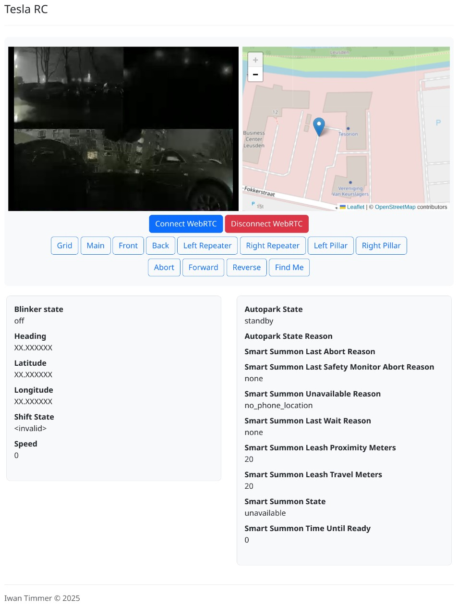

# Tesla Remote Control PoC



This is a proof of concept of the implementation of the Actual Smart Summon API for Tesla vehicles.

Code is for educational purposes only.
This project is not affiliated with Tesla Inc. and is not endorsed by them.
Any damage caused to the vehicle or any other object is the responsibility of the user.

NOTE: Due restrictions, in most countries, except North America, the use of the Smart Summon feature requires a bluetooth key in 6m range of the car.
While the vehicle-command SDK can be used to emulate a bluetooth key, instructions on the requirements for the Smart Summon feature are not yet documented.

## Features

- Show Smart Summon status.
- Get Sentry live feed using WebRTC in Chromium browsers.
- Change the camera view.
- Display the car's location on a map and select target.
- Send forward, backward and summon commands to the car.

## Description

A fork of the Tesla Vehicle Command SDK is required to use this project.
The SDK provides a proxy server that will handle the authentication with the Tesla API and do the required signing and encryption of the requests.

The proxy server will provide a WebSocket server to talk with the car.
This project provides a simple web interface to talk with the car over the WebSocket connection and setting up a WebRTC connection for receiving video.

## Usage

1. Clone the vehicle-command fork from https://github.com/irtimmer/vehicle-command and checkout the `hermes-stream-session` branch
2. Build the tesla-http-proxy and tesla-keygen commands
```bash
cd cmd/tesla-http-proxy
go get ./...
go build ./...
cd ../tesla-keygen
go build ./...
```
3. Create a command-authentication private key
```bash
cmd/tesla-keygen/tesla-keygen -key private.key
```
4. Upload the public key to the car. See the vehicle-command documentation for more information.
5. Create a server TLS key and certificate
```bash
mkdir config
openssl req -x509 -nodes -newkey ec \
    -pkeyopt ec_paramgen_curve:sec-P256 \
    -pkeyopt ec_param_enc:named_curve  \
    -subj '/CN=localhost' \
    -keyout config/tls-key.pem -out config/tls-cert.pem -sha256 -days 3650 \
    -addext "extendedKeyUsage = serverAuth" \
    -addext "keyUsage = digitalSignature, keyCertSign, keyAgreement"
```
6. Clone the tesla-auth project from https://github.com/adriankumpf/tesla_auth
7. Build the tesla-auth command `cargo build`
8. Run the tesla-auth command to get a JWT token for the Owner API `./target/debug/tesla-auth`
9. Run the tesla-http-proxy command with the required parameters and set the JWT token as an environment variable
```bash
EXPORT TESLA_HTTP_PROXY_JWT=ey...
TESLA_KEY_FILE=./private.key cmd/tesla-http-proxy/tesla-http-proxy -cert config/tls-cert.pem -tls-key config/tls-key.pem -mode owner -verbose -port 8443
```
10. Open the https://localhost:8443/ URL in a Chromium browser and accept the self-signed certificate
11. Start a webserver to serve the files in the `public` directory
12. Ensure the car is awake and Sentry mode is enabled to receive the live feed
13. Open the web interface in the browser with as get parameter `?vin=your_vin`
